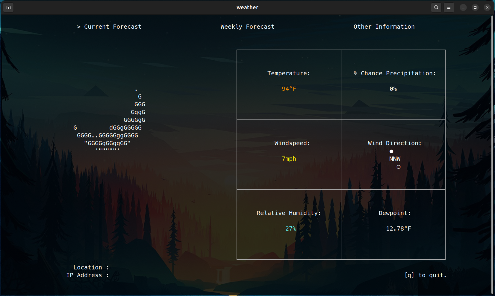
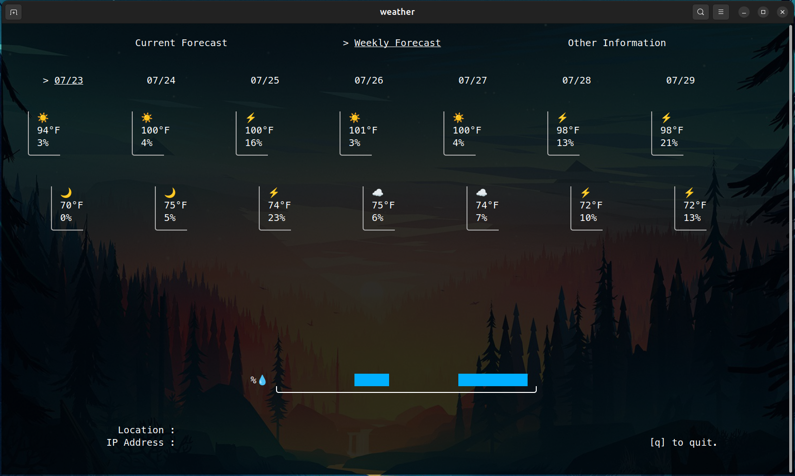

# About

This is a program I made for myself to learn about API calls and bash programming language, as well as just to have a terminal-based weather application I can run anytime I have my terminal open.
I can't speak to how well it will translate to other machines: it's for linux obviously and sized to my default terminal dimensions (136x36). I've added the infrastructure for a third page just in case.

(longitude, latitude, and IP address redacted)

## Known Issues

- For some god-forsaken reason, the weekly forecast page will flip day and night rows (and skip a day). It happens inconsistently and everytime I check the .json from NWS, everything looks normal. The python variables just have incorrect data for some reason. The next day everything will work fine.
- The emoji reporting on the second page isn't very modular. NWS likes to throw all sorts of jargon in their "short forecast." So I made an effort to filter it but random words make it through sometimes.
